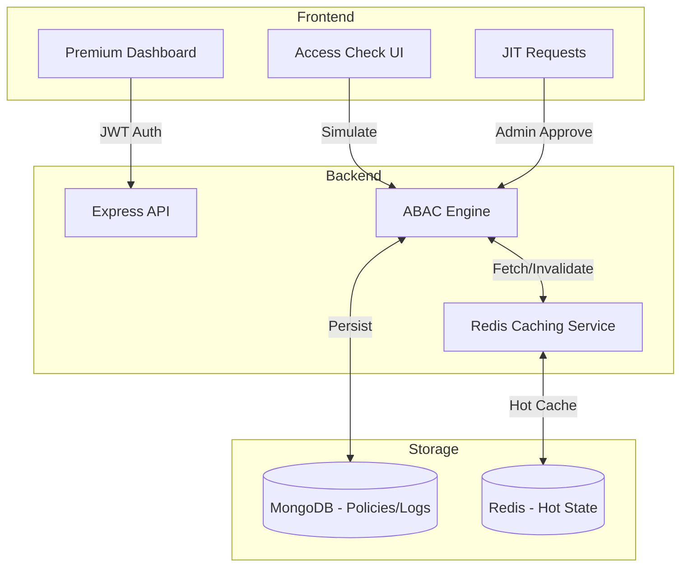

<div align="center">

# 🔐 ABAC Access Control System

**Advanced Attribute-Based Access Control Platform with JIT Access & Real-time Monitoring**

[](#)
[](#)
[](#)

[Features](#-key-features) • [Architecture](#-architecture) • [Live Demo](#-live-deployment) • [Tech Stack](#-tech-stack) • [Setup](#-getting-started) • [API](#-api-documentation)

</div>

---

## 🚀 Live Deployment

| Service | Platform | URL | Status |
| :--- | :--- | :--- | :--- |
| **Frontend** | Vercel | [abac-access-control.vercel.app](https://abac-access-control.vercel.app) |  |
| **Backend API** | Render | [abac-access-control.onrender.com](https://abac-access-control.onrender.com) |  |
| **Health Check** | Render | [/api](https://abac-access-control.onrender.com/api) |  |

---

## 🌟 Key Features

### 🛡️ Core ABAC Engine
- **Attribute-Based Evaluation**: Define policies using User, Resource, and Environment attributes.
- **Priority System**: High-priority overrides (e.g., JIT permissions) are evaluated first.
- **Dynamic Conditions**: Support for complex logic (e.g., `env.hour < 17`, `user.department == 'Medical'`).
- **Logical Trace Tree**: "Why Denied?" diagnostic tool visualizing the exact evaluation path.

### ⚡ Just-In-Time (JIT) Access
- **JIT Request Workflow**: Request temporary permissions for restricted resources.
- **Admin Management**: Dashboard for real-time request approval/denial.
- **Auto-Expiration**: JIT policies automatically revoke after the requested duration.

### 📊 Security Observability
- **Health Scorecard**: Real-time system integrity monitoring.
- **🔥 Threat Heatmap**: Visual identification of "Top Denied" resources.
- **Audit Logs**: Comprehensive logging of every authorization attempt with full context.

### 🚀 Performance & UX
- **Redis Caching**: Sub-50ms authorization latency via policy and resource caching.
- **Premium UI**: Dark mode optimized with 3D icon animations and real-time polling.

### 🧠 AI Policy Copilot (Anakin AI)
- **Intelligent Database Layer**: Integrates the Anakin AI API to dynamically evaluate high-risk policies and identify complex authorization anomalies before they reach the execution phase.
- **Real-Time Threat Intelligence**: Acts as a secondary analytical provider within the database engine to auto-lockdown compromised resources continuously monitoring audit logs.

---

## 🏗️ Architecture

The system uses a centralized ABAC engine that decouples authorization logic from the business layer.



---

## 🛠️ Tech Stack

### Frontend
| Technology | Purpose | Version |
|------------|---------|---------|
| [React](https://react.dev/) | UI Framework | 18.x |
| [Recharts](https://recharts.org/) | Data Visualization | 2.x |
| [Framer Motion](https://www.framer.com/motion/) | 3D Animations | 11.x |
| [Axios](https://axios-http.com/) | API Client | 1.x |
| [React Router](https://reactrouter.com/) | Navigation | 6.x |

### Backend
| Technology | Purpose | Version |
|------------|---------|---------|
| [Node.js](https://nodejs.org/) | Runtime | 20.x |
| [Express](https://expressjs.com/) | API Framework | 4.x |
| [MongoDB](https://www.mongodb.com/) | Policy/Audit Store | 7.x |
| [Redis](https://redis.io/) | Caching Layer | 4.x |
| [Mongoose](https://mongoosejs.com/) | ODM | 8.x |
| [JWT](https://jwt.io/) | Authentication | 9.x |

---

## 📦 Getting Started

### Prerequisites
```bash
Node.js >= 18
MongoDB >= 6.0
Redis Server >= 6.0
```

### Quick Start

#### 1️⃣ Clone Repository
```bash
git clone https://github.com/Annu881/ABAC-Access-Control.git
cd ABAC-Access-Control
```

#### 2️⃣ Backend Setup
```bash
cd backend
npm install
npm run seed     # Important: Setup initial policies & admin
npm run dev      # Server runs on http://localhost:5000
```

#### 3️⃣ Frontend Setup
```bash
cd frontend
npm install
PORT=3001 npm start   # App runs on http://localhost:3001
```

---

## 📊 API Documentation

### Key Endpoints

| Method | Endpoint | Description |
|--------|----------|-------------|
| POST | `/api/auth/register` | Create new user account |
| POST | `/api/auth/login` | Authenticate and get token |
| POST | `/api/access/evaluate` | **Core Engine**: Evaluate access |
| GET | `/api/dashboard/stats` | System health & stats |
| POST | `/api/requests/submit` | Submit JIT access request |
| GET | `/api/requests/pending` | Admin: List pending requests |
| POST | `/api/requests/:id/approve` | Admin: Approve and create JIT Policy |
| GET | `/api/audit/logs` | Fetch authorization audit trail |

---

## 🤝 Contributing
1. Fork the repo.
2. Create your feature branch (`git checkout -b feature/AmazingFeature`).
3. Commit changes (`git commit -m 'Add AmazingFeature'`).
4. Push to branch (`git push origin feature/AmazingFeature`).
5. Open a Pull Request.

---

## 👤 Author
**Annu881**
- GitHub: [@Annu881](https://github.com/Annu881)
- Project: [ABAC-Access-Control](https://github.com/Annu881/ABAC-Access-Control)

<div align="center">

**⭐ Star this repo if it helps you secure your apps!**

Made with ❤️ by [Annu881](https://github.com/Annu881)

</div>
